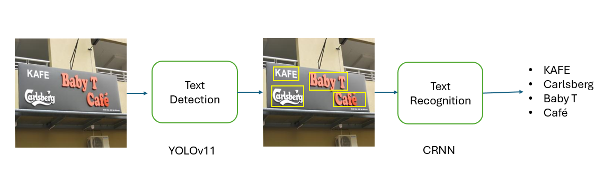

# **End-to-End Scene Text Detection and Recognition System**

This project implements an End-to-End system for detecting and recognizing text in natural images. It combines two key modules:

Text Detection – uses YOLOv11 to identify text in images

Text Recognition – uses CRNN for text recognition.

# **Pipeline**



# **How to run it**

## Setup Env

```bash
python -m venv .venv
source .venv/bin/activate
pip install -r requirements.txt
```

## Run Server

```bash
cd deployment
make init
```

## Start deployment

```bash
cd deployment
make deploy_ocr
```

## Start the Streamlit App

```bash
cd deployment
make streamlit
```

Now the UI is avaiable at `localhost:8501`

# **Demo**


